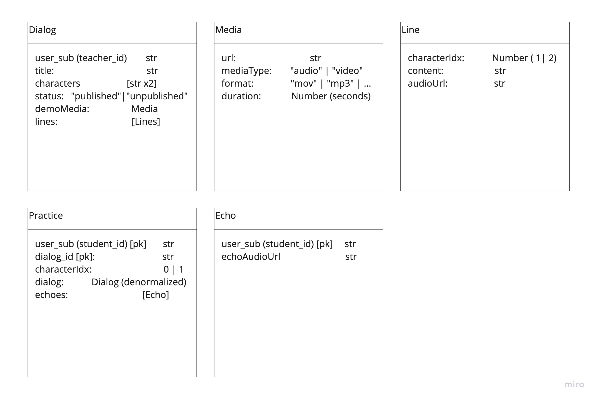
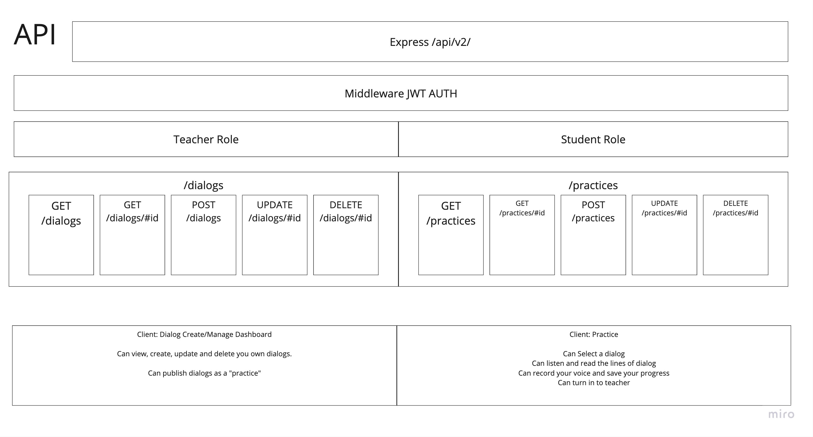
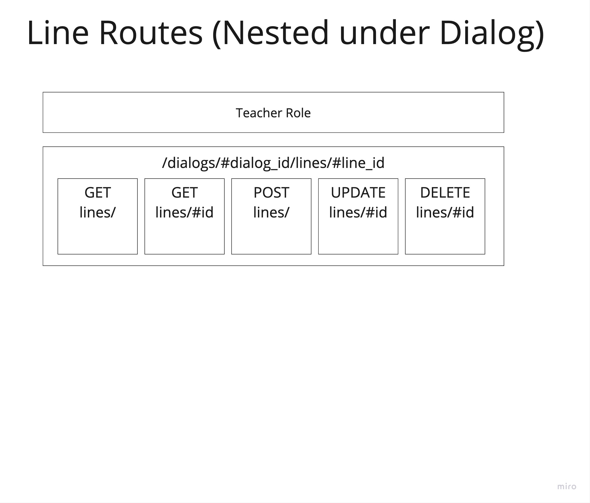
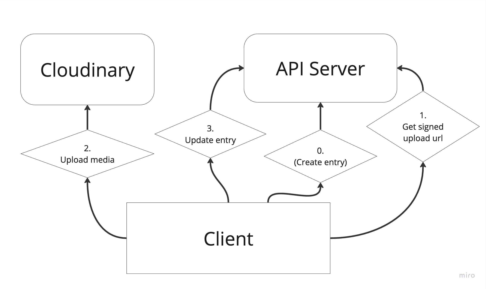

## Description

Have you ever watched a movie in a foreign language and thought "I wish I could do that!"

Well, now you can!

This project has two parts. One is for the teachers to create a dialog from a video (audio) clip. The other is for the students to practice. The teacher's section "Dialogs" because they create dialogs for students to follow. The students' section is called "Echoes" because they echo the audio they hear.

## Feature Roadmap

* A class management tool for teachers to organize their classes and assignments
* A grading section for teachers to give feedback.
* A way to pair with others in the class to work on a dialog with a partner.
* Real-time machine assisted feedback to students on the voice recordings.

Live link: [https://dramaecho.robertm.cc](https://dramaecho.robertm.cc)

## Schematics

### Models

The database used is MongoDB.

There are two main models: Dialog and Practice. Dialog is owned by a teacher user. Practice is owned by a student user.

### API Routes

#### Major routes

#### Nested routes

#### Cloudinary signed uploads

In order to provide efficient uploads, we can sign them and upload directly to Cloudinary servers.

## Installation and contributing

This app is built with Create React App and Express.js in Node.

To test this app locally you will also need a MongoDB database available and an Auth0 account.

This is build as a mono-repo. So you will need to start the react dev server in the `app` directory, as well as the server in the `server` directory.

See the .env-template file in both the `app` and `server` directorys for all the necessary keys.

